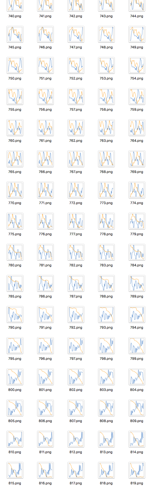

# CNN / RNN time series classification model
<hr />

## Abstract
Reusable CNN and RNN model doing time series binary classification

Watch `run.py` ,`utils.py`, `models.py` for detail code

Run `run.py` to use model

Can compare the accuracy of CNN and RNN  doing time series binary classification

## Dependancies
1. python Version: 3.5.3
2. numpy Version: 1.13.0
3. tensorflow Version: 1.2.1
4. matplotlib Version: 2.0.2

## Dataset
The dataset I used.

Bitcoin Ticker Data
- 1 minite
- korbit
- btc_krw
- last, volume
- from 2016.06.28 to 2017.07.14

**You can change dataset and train and test easily.**

## CNN model
Inspired by [this paper](https://www.google.co.kr/url?sa=t&rct=j&q=&esrc=s&source=web&cd=1&cad=rja&uact=8&ved=0ahUKEwjCqNuZwJHVAhUBoZQKHQWUC7gQFgghMAA&url=http%3A%2F%2Fcs231n.stanford.edu%2Freports%2F2015%2Fpdfs%2Fashwin_final_paper.pdf&usg=AFQjCNF97ttipFHq_zUgOslsKruVwIumfA)

Change 30 minite time series data into 2-d graph and save it into .png file.

Convert .png file into numpy array, for example [50,50,4]  (imgsize = 50*50, channel = 4).

Put that numpy array into CNN model and train .

CNN model predicts whether data goes up or down after 5 minite .

I applied this model into Bitcoin Ticker Data.

#### x_data of CNN model


## RNN model
Just simple RNN model

input : 30 minite time seies data

predicts :  whether data goes up or down after 5 minite

## Key Features

#### 1. reusable
You can save trained variables and reuse it easily.

Just use option flag.

If you reuse trained variables, it automatically calculate accuracy on validation set.
```
$ python3 run.py --name="cnn1reuse" --model="cnn" --ckptfile="./ckpt/cnn1.ckpt"

```
#### 2. visualize filters (CNN)
You can visuaize CNN model filters easily by running `visualize_weight.py`
